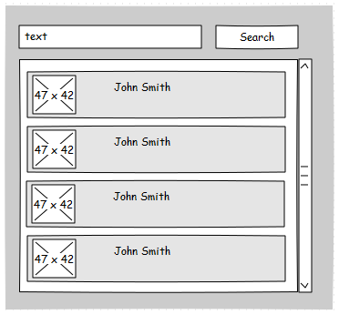
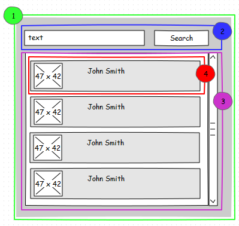

# React: Creating a simple Live Chat [WIP]

## Overview
To reinforce the knowledge gained from each level, each of these will have a final work. At the end of the last level, we will have a **live chat** working in **react-redux**.

## Get down to work

### Description
For this first delivery, we will work only in the contact's list without any functionality. Take a look to the screenshot below:

### Requirements
* Use **Create React App** to environment setup (quick win)
* This Level not included functionality, **read only**
* Use the state to keep contact's list -- **Initial State**
* Use the props for communication between componentes
* Use props validation for all the cases

### A little help ...
In the first place, take a look to the image from description section and try to think that image like components. Once you have an idea how to divide in components that image, you can tried your idea or go ahead with our recommendation:

 1. Contact's List
 2. Search Box
 3. List
 4. Contact Item

Please see the screenshot below for clarify:

**Download source code**